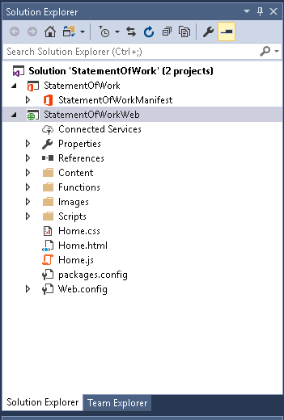
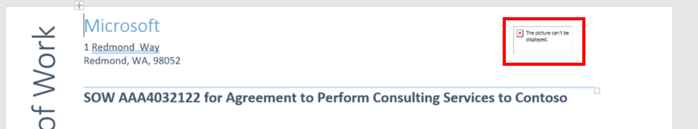

# Build Your First Office Integration with Visual Studio

## Overview
With Office Add-ins, you can add new functionality to Office and embed your rich and interactive content. In this walk through, you will get hands-on experience developing a Word add-in with Visual Studio. If you would instead like to create an add-in using our command-line tools, see [Building Your First Office Integration with Yo Office](Yo.md). 

## Tools You'll Use
Visual Studio

## Part 1: Getting Started
1. Launch Visual Studio 2015.
2. From the **File** menu, select the **New Project** command. When the **New Project** dialog appears, select the Word Add-in under Web Add-ins in the **Office/SharePoint** template folder as shown below. Name the new project **StatementOfWork** and click **OK** to create the new project.

	


3. Take a look at the structure of the new Visual Studio solution after it has been created. At a high-level, the new solution has been created using two Visual Studio projects named **StatementOfWork** and **StatementOfWorkWeb**. You should also observe that the top project contains a top-level manifest for the add-in named **StatementOfWorkManifest**, which contains a single file named **StatementOfWork.xml**.

	

## Part 2: Customize the Office Ribbon UI

1. In the Solution Explorer, double-click on the node named **StatementOfWorkManifest** to open the add-in manifest file in the Visual Studio editor. Browse through the file and note the different options you can set for your Add-in, such as provider, version, Display Name.

2. Now, find the XML block that looks like this (line 72). Take a minute and read through it as it describes how add-ins can integrate with the Office UI. The example below demonstrates how an add-in can add a button to the Word ribbon's Home tab using Add-in commands. 

	```XML
        <!-- PrimaryCommandSurface==Main Office Ribbon. -->
            <ExtensionPoint xsi:type="PrimaryCommandSurface">
                <!-- Use OfficeTab to extend an existing Tab. Use CustomTab to create a new tab. -->
                <OfficeTab id="TabHome">
                <!-- Ensure you provide a unique id for the group. Recommendation for any IDs is to namespace using your company name. -->
                <Group id="Contoso.Group1">
                    <!-- Label for your group. resid must point to a ShortString resource. -->
                    <Label resid="Contoso.Group1Label" />
                    <!-- Icons. Required sizes 16,32,80, optional 20, 24, 40, 48, 64. Strongly recommended to provide all sizes for great UX. -->
                    <!-- Use PNG icons and remember that all URLs on the resources section must use HTTPS. -->
                    <Icon>
                    <bt:Image size="16" resid="Contoso.tpicon_16x16" />
                    <bt:Image size="32" resid="Contoso.tpicon_32x32" />
                    <bt:Image size="80" resid="Contoso.tpicon_80x80" />
                    </Icon>

                    <!-- Control. It can be of type "Button" or "Menu". -->
                    <Control xsi:type="Button" id="Contoso.TaskpaneButton">
                    <Label resid="Contoso.TaskpaneButton.Label" />
                    <Supertip>
                        <!-- ToolTip title. resid must point to a ShortString resource. -->
                        <Title resid="Contoso.TaskpaneButton.Label" />
                        <!-- ToolTip description. resid must point to a LongString resource. -->
                        <Description resid="Contoso.TaskpaneButton.Tooltip" />
                    </Supertip>
                    <Icon>
                        <bt:Image size="16" resid="Contoso.tpicon_16x16" />
                        <bt:Image size="32" resid="Contoso.tpicon_32x32" />
                        <bt:Image size="80" resid="Contoso.tpicon_80x80" />
                    </Icon>

                    <!-- This is what happens when the command is triggered (E.g. click on the Ribbon). Supported actions are ExecuteFuncion or ShowTaskpane. -->
                    <Action xsi:type="ShowTaskpane">
                        <TaskpaneId>ButtonId1</TaskpaneId>
                        <!-- Provide a url resource id for the location that will be displayed on the task pane. -->
                         <SourceLocation resid="Contoso.Taskpane.Url" />
                    </Action>
                    </Control>
                </Group>
                </OfficeTab>
            </ExtensionPoint>
	```
    
3. Let's modify the button to say "Statement of Work" instead of "Show Taskpane". Find the following element in the file (line 89).

	```XML
		<Title resid="Contoso.TaskpaneButton.Label" />
	```
	This indicates that the label of the title is stored in a string resource named **Contoso.TaskpaneButton.Label**.
4. Scroll down until you find the **ShortString** string resource with that label (line 130).
5. Now, set the DefaultValue attribute to *Statement of Work*. Your XML should look like this: 

	```XML
		<bt:String id="Contoso.TaskpaneButton.Label" DefaultValue="Statement of Work" />
	```
        
6. Save the file. Press *F5* (or click the "Start" button) to try your changes. If you're prompted to installed a self-signed certificate for localhost, accept the two dialogs. You should see your add-in deploy in Word and a button appear on the Home Tab. 


	


7. Close Word to stop debugging. Then switch back to Visual Studio.

## Part 3: Insert content to document
Now, let's move on to add functionality to the add-in. There are two very important files that are in the root of the StatementOfWorkWeb project. One of them is the  **Home.html** page which is opened by default in Visual Studio and represents the add-in's starting page. If not already opened please double click on it, you will see some HTML that begins like this: 

```html
<head>
    <meta charset="UTF-8" />
    <meta http-equiv="X-UA-Compatible" content="IE=Edge" />
    <title>Word Addin with Commands Sample</title>

    <script src="/Scripts/jquery-1.9.1.js" type="text/javascript"></script>
    <script src="/Scripts/FabricUI/MessageBanner.js" type="text/javascript"></script>
    <script src="https://appsforoffice.microsoft.com/lib/1/hosted/office.js" type="text/javascript"></script>

    <!-- To enable offline debugging using a local reference to Office.js, use:                        -->
    <!-- <script src="/Scripts/Office/MicrosoftAjax.js" type="text/javascript"></script>  -->
    <!-- <script src="/Scripts/Office/1.1/office.js" type="text/javascript"></script>  -->

    <link href="Home.css" rel="stylesheet" type="text/css" />
    <script src="Home.js" type="text/javascript"></script>

    <!-- For the Office UI Fabric, go to http://aka.ms/office-ui-fabric to learn more. -->
    <link rel="stylesheet" href="https://appsforoffice.microsoft.com/fabric/2.1.0/fabric.min.css">
    <link rel="stylesheet" href="https://appsforoffice.microsoft.com/fabric/2.1.0/fabric.components.min.css">
    
    <!-- To enable the offline use of Office UI Fabric, use: -->
    <!-- link rel="stylesheet" href="/Content/fabric.min.css" -->
    <!-- link rel="stylesheet" href="/Content/fabric.components.min.css" -->
</head>
```

There are important references included in the **Home.html** head element. One for our Office.js library **<script src="https://appsforoffice.microsoft.com/lib/1/hosted/office.js" type="text/javascript"></script>**, which enables the developer to interact with Word. There is also a reference to include  Office UI Fabric components, which are the styles you can use to make your add-in look great. Finally, there is also a reference to **Home.js** script on this page, which implements the logic of the add-in.
 
First, we are going to edit the JavaScript code in **Home.js**.

1. Double-click **Home.js** to open it in a code editor window.
2. Replace the content of the entire file with the following snippet, so that your Home.js looks like this:

	```javascript
	/// <reference path="/Scripts/FabricUI/MessageBanner.js" />


	(function () {
	    "use strict";

	    var messageBanner;

	    // The initialize function must be run each time a new page is loaded.
	    Office.initialize = function (reason) {
		$(document).ready(function () {
		    // Initialize the FabricUI notification mechanism and hide it
		    var element = document.querySelector('.ms-MessageBanner');
		    messageBanner = new fabric.MessageBanner(element);
		    messageBanner.hideBanner();

		    // Add event handlers here....
		    $("#insert-content").click(insertContent);
		    $("#add-content-controls").click(addContentControls);
		    $("#change-customer").click(changeCustomer);
		    $("#add-footer").click(addFooter); 
		});
	    };

	    // Inserts initial content into the template.
	    function insertContent() {

	    }

	    // Search the document for instances of the string "Contractor". Change the format  of
	    // each search result, and wrap each search result in a content control. Set the tag and title property on each content control.
	    function addContentControls() {

	    }

	    function changeCustomer() {

	    }

	    function addFooter() {

	    }
	    
	})();

	```

	This will create a scaffold for the functionality you will continue to develop through this walkthrough.
	
3. Next, let's add the logic to insert content into the document. Add the following code to the **insertContent** function.

	```javascript

	function insertContent() {
		// Inserts a heading 1 Title.
		Word.run(function (context) {
		    var header = context.document.body.insertText("This is a sample Heading 1 Title!!", "start");
		    header.styleBuiltIn = Word.Style.heading1;
		    return context.sync();
		})
		    .catch(console.log);
		// Insert a set of paragraphs, a content control and a page break.
		Word.run(function (context) {
		    var paragraph = context.document.body.insertParagraph("Timeline", "end");
		    paragraph.style = "Heading 2";
		    var paragraph2 = context.document.body.insertParagraph("The Services shall commence on July 31, 2015, and shall continue through July 29, 2015.", "end");
		    paragraph2.style = "Normal";
		    var paragraph3 = context.document.body.insertParagraph("Project Costs by Phase", "end");
		    paragraph3.style = "Heading 2";
		    // Note a content control with the title of "ProjectCosts" is added. Content will be replaced later.
		    var paragraph4 = context.document.body.insertParagraph("<Add Project Costs Here>", "end");
		    paragraph4.style = "Normal";
		    paragraph4.font.highlightColor = "#FFFF00";
		    var contentControl = paragraph4.insertContentControl();
		    contentControl.title = "ProjectCosts";

		    var paragraph5 = context.document.body.insertParagraph("Project Team", "end");
		    paragraph5.style = "Heading 2";
		    paragraph5.font.highlightColor = "#FFFFFF";

		    var paragraph6 = context.document.body.insertParagraph("Terms of Work", "end");
		    paragraph6.style = "Heading 1";

		    var paragraph7 = context.document.body.insertParagraph("Contractor shall provide the Services and Deliverable(s) as follows:", "end");
		    paragraph7.style = "Normal";

		    var paragraph8 = context.document.body.insertParagraph("Out-of-Pocket Expenses / Invoice Procedures", "end");
		    paragraph8.style = "Heading 2";

		    var paragraph9 = context.document.body.insertParagraph("Client will be invoiced monthly for the consulting services and T&L expenses. Standard Contractor invoicing is assumed to be acceptable. Invoices are due upon receipt. client will be invoiced all costs associated with out-of-pocket expenses (including, without limitation, costs and expenses associated with meals, lodging, local transportation and any other applicable business expenses) listed on the invoice as a separate line item. Reimbursement for out-of-pocket expenses in connection with performance of this SOW, when authorized and up to the limits set forth in this SOW, shall be in accordance with Client's then-current published policies governing travel and associated business expenses, which information shall be provided by the Client Project Manager.", "end");
		    paragraph9.style = "Normal";
		    // Insert a page break at the end of the document.
		    context.document.body.insertBreak("page", "End");
		    return context.sync()
			.catch(console.log);
		});
	    }

	```
	
	This will create a starting document with a title, followed by paragraphs with different styles, content controls, and a page break.

	Your final Home.js file should look as follows:

	```javascript
	/// <reference path="/Scripts/FabricUI/MessageBanner.js" />


	(function () {
	    "use strict";

	    var messageBanner;

	    // The initialize function must be run each time a new page is loaded.
	    Office.initialize = function (reason) {
		$(document).ready(function () {
		    // Initialize the FabricUI notification mechanism and hide it
		    var element = document.querySelector('.ms-MessageBanner');
		    messageBanner = new fabric.MessageBanner(element);
		    messageBanner.hideBanner();

		    // Add event handlers here....
		    $("#insert-content").click(insertContent);
		    $("#add-content-controls").click(addContentControls);
		    $("#change-customer").click(changeCustomer);
		    $("#add-footer").click(addFooter);    
		});
	    };

	// Inserts initial content into the template.
	function insertContent() {
		// Inserts a heading 1 Title.
		Word.run(function (context) {
		    var header = context.document.body.insertText("This is a sample Heading 1 Title!!", "start");
		    header.styleBuiltIn = Word.Style.heading1;
		    return context.sync();
		})
		    .catch(console.log);
		// Insert a set of paragraphs, a content control and a page break.
		Word.run(function (context) {
		    var paragraph = context.document.body.insertParagraph("Timeline", "end");
		    paragraph.style = "Heading 2";
		    var paragraph2 = context.document.body.insertParagraph("The Services shall commence on July 31, 2015, and shall continue through July 29, 2015.", "end");
		    paragraph2.style = "Normal";
		    var paragraph3 = context.document.body.insertParagraph("Project Costs by Phase", "end");
		    paragraph3.style = "Heading 2";
		    // Note a content control with the title of "ProjectCosts" is added. Content will be replaced later.
		    var paragraph4 = context.document.body.insertParagraph("<Add Project Costs Here>", "end");
		    paragraph4.style = "Normal";
		    paragraph4.font.highlightColor = "#FFFF00";
		    var contentControl = paragraph4.insertContentControl();
		    contentControl.title = "ProjectCosts";

		    var paragraph5 = context.document.body.insertParagraph("Project Team", "end");
		    paragraph5.style = "Heading 2";
		    paragraph5.font.highlightColor = "#FFFFFF";

		    var paragraph6 = context.document.body.insertParagraph("Terms of Work", "end");
		    paragraph6.style = "Heading 1";

		    var paragraph7 = context.document.body.insertParagraph("Contractor shall provide the Services and Deliverable(s) as follows:", "end");
		    paragraph7.style = "Normal";

		    var paragraph8 = context.document.body.insertParagraph("Out-of-Pocket Expenses / Invoice Procedures", "end");
		    paragraph8.style = "Heading 2";

		    var paragraph9 = context.document.body.insertParagraph("Client will be invoiced monthly for the consulting services and T&L expenses. Standard Contractor invoicing is assumed to be acceptable. Invoices are due upon receipt. client will be invoiced all costs associated with out-of-pocket expenses (including, without limitation, costs and expenses associated with meals, lodging, local transportation and any other applicable business expenses) listed on the invoice as a separate line item. Reimbursement for out-of-pocket expenses in connection with performance of this SOW, when authorized and up to the limits set forth in this SOW, shall be in accordance with Client's then-current published policies governing travel and associated business expenses, which information shall be provided by the Client Project Manager.", "end");
		    paragraph9.style = "Normal";
		    // Insert a page break at the end of the document.
		    context.document.body.insertBreak("page", "End");
		    return context.sync()
			.catch(console.log);
		});
	    }
	    // Search the document for instances of the string "Contractor". Change the format  of
	    // each search result, and wrap each search result in a content control. Set the tag and title property on each content control.
	    function addContentControls() {

	    }

	    function changeCustomer() {

	    }

	    function addFooter() {

	    }
	})();

	 

	```
	
5. Save your changes to **Home.js**. You will return to this source file after you have added your HTML layout to **Home.html**.
6. Now it's time to examine the HTML that has been added to the project to create the add-in's user interface. Double-click **Home.html** to open this file in a Visual Studio editor window. 


7. Update the **content-main** div within *Home.html* to match the following HTML layout, which adds a set of buttons to the add-in's layout. These are all the buttons you need for the lab.

	```html
   <div id="content-main">
        <div id="sowPanel" class="padding">
            <button class="ms-Button ms-Button--compound" id="addContentStartingSOW">
                <span class="ms-Button-label" id="button-text">Step 1: Starting SOW</span>
                <span class="ms-Button-description" id="button-desc">Insert a starting document to play with. uses OOXML</span>
            </button><br><br>

            <button class="ms-Button ms-Button--compound" id="addPicture">
                <span class="ms-Button-label" id="button-text">Step 2: Fix Picture!</span>
                <span class="ms-Button-description" id="button-desc">How to insert or replace images in a document.</span>
            </button><br><br>

            <button class="ms-Button ms-Button--compound" id="addSearchAndTempletize">
                <span class="ms-Button-label" id="button-text">Step 3: Search and Templetize!</span>
                <span class="ms-Button-description" id="button-desc">Search for 'Contoso' and insert content controls to hold the customer name. </span>
            </button><br><br>

            <button class="ms-Button ms-Button--compound" id="addChangeCustomer">
                <span class="ms-Button-label" id="button-text">Step 4: Replace Customer!</span>
                <span class="ms-Button-description" id="button-desc">Set the customer name to 'Fabrikam' using content controls.</span>
            </button><br><br>
        </div>
	```

8. Save and close **Home.html**.

9. Let's try the add-in to see the progress. Press the **{F5}** key to run the project in the Visual Studio debugger. The debugger should launch Word 2016. 
	> **Note**: Once Word opens, make sure you launch your add-in by clicking on the **Show Taskpane** button on the ribbon. You will have to repeat this operation each time you hit F5. 

10. After you click on this button you should see your Office Add-in in the task pane on the right side of a new Word document, as shown in the following screenshot.

	

11. Click the **Step 1: Starting SOW** button. When you click the button, you should see that the starting Statement of Work has been added to the Word document.

	
	
	Don't feel overhelmed with the OOXML file you inserted; if you want to master how to handle OOXML we recommend you to read the article at **msdn.microsoft.com/en-us/library/office/dn423225.aspx** article. Close Word to terminate your debugging session and return to Visual Studio.
	

## Part 4: Replace image in document

Notice how the inserted SOW has a badly formatted picture **highlighted in red below**. 



Let's fix this image.

1. Go back to Visual Studio, make sure you are using the StatementOfWork project.

2. In the Solution Explorer, double-click on **Home.js** to open this JavaScript file.
3. Add the following code snippet to the **onFixPicture** function.

	```javascript
	   function onFixPicture() {
		// my strategy to change the pic here is the following
		//a. will get the collection of images within the body.
		//b. will grab the first image within the collection and replace it with a new image.

		//this example is using methods shipped on the 1.2 requirement set. specificlaly the insertInlinePicture method supported on the inlinePicture object to replace the image.....
		if (Office.context.requirements.isSetSupported("WordApi", "1.2")) {
		    Word.run(function (context) {
			// gets the inlinePictures collection for the document.
			var pics = context.document.body.inlinePictures;
			context.load(pics);
			return context.sync()
			    .then(function () {
				var mybase64 = getImageAsBase64();
				pics.items[0].insertInlinePictureFromBase64(mybase64, "replace");
				return context.sync()
				    .then(function () {
					showNotification("Task Complete!");
				    })
			    })
		    })
		    .catch(function (myError) {
			//otherwise we handle the exception here!
			showNotification("Error", myError.message);
		    })
		}
		else {
		    showNotification("Error. This functionality requires Word with at least January update!! (check  builds 6741+)");
		}
	    }
	```

	Note that the code is checking if the host (Word) actually supports the 1.2 requirements set. This is important to check because in order to replace an image, the  **inlinePicture.insertInlinePictureFromBase64** method is needed and this was shipped as part of the 1.2 requirement set. Note that by traversing the **inlinePictures collection**, we get the first image and then we are replacing it with the correct one.
	

4. Test your work by pressing F5 to start a debug session and then click the **Step 1: Starting SOW** button. After the document gets inserted click on the  **Step 2: Fix Picture!** button to try your code. The image should be replaced and the document should look like this:

	 


## Part 5: Search and insert Content Controls

A common scenario in Word development is reusing documents to create new ones. A "Statement of Work" (SOW) is a very good example of this. By replacing a few fields, an existing SOW may be a completely new SOW instance. This is done through Content Controls. Content controls are a key building block in Word development and using them enables developers to insert 'placeholders' in the document that can be later identified and replaced with different content.

To illustrate that point, we will implement a simple example of how a template can be created. Then, we will replace the content of all content controls tagged as 'customer' with 'Fabrikam'. Note that this could very well come from data stored in an external system, like a CRM, ERP, etc. The idea is to generate a new instance of a document with a new customer.

1. Go back to Visual Studio, and in the Solution Explorer, double-click on **Home.js** to open this JavaScript file.
2. Add the following code to the **onSearchAndTempletize** function:

	```javascript
	function onSearchAndTempletize() {
		// on this method I actually want to create kind of a template. Will start by searching "Contoso". Then I will wrap each instance with a content control
		// I will also change the format of each search instance...

		Word.run(function (ctx) {
		    var results = ctx.document.body.search("Contoso");
		    ctx.load(results);
		    // we need to sync to get the search results/
		    return ctx.sync()
		    .then(function () {
			//once we have the results we navigate through each occurrence and change a few things, as well as wrapping with a content control.
			for (var i = 0; i < results.items.length; i++) {
			    results.items[i].font.color = "#FF0000"    // Change color to Red
			    results.items[i].font.highlightColor = "#FFFF00";
			    results.items[i].font.bold = true;
			    var cc = results.items[i].insertContentControl();
			    cc.tag = "customer";  // this is an important piece of code, later on the exercise I will retrieve all the content controls with this tag and replace the content.
			    cc.title = "Customer Name";
			}
			return ctx.sync()  // OK ready! lets send it to the host for processing :)
		    })
		    .then(function () {
			showNotification("Task Complete!");
		    })
		    .catch(function (myError) {
			showNotification("Error", myError.message);
		    })
		});


	    } 
	```
	
	Note that the code is searching for "Contoso". The search method returns a collection of ranges matching the search criteria. The code iterates through that collection and wraps each instance with a content control. It is also important to note that you are adding to each content control a tag with a "customer" title. This is important as we will use this information to replace the content of all the content controls with this tag with a new customer's name.  

3. Test your work by pressing F5 to start a debug session and then click the **Step 1: Starting SOW** button. After the starting document gets inserted, click on the  **Step 3: Search and Templetize!** button to try your code. Each "Contoso" instance should be wrapped with a content control and with a yellow highlight. For visibility purposes we are also adding a red font color and yellow highlight to each search result instance. Your document should look like this after you click on the Step 1 and Step 3 buttons:


	 
	


4. Make sure to select any of the 'Contoso' search instances and verify they were tagged as 'customer'. To check this make sure that the Developer tab in the Word ribbon is activated. Go to File->Options->Customize Ribbon  and make sure in the right panel that 'Developer' is selected.

	 


5. Then, while having the cursor within any 'Contoso' instance, click on the Developer tab and then on 'Properties'. You will see each content control has the 'customer' tag.

	 

6. CLose Word and go back to the **Home.js** file in Visual Studio. Make sure you are using the StatementOfWord project.

7. Add the following code to the **onaddChangeCustomer** function:

	```javascript
	function onaddChangeCustomer() {
	Word.run(function (ctx) {
		    var ccs = ctx.document.contentControls.getByTag("customer");
		    ctx.load(ccs, { select: 'text', expand: 'font' }); // i want to change the font highlight color, so i need to expand font. note i can also do select" 'font/highlightColor', but not in the mood :)
		    return ctx.sync()  // lets get all the content controls with the above tag
		    .then(function () {
			//lets iterate and change!!!
			for (var i = 0; i < ccs.items.length; i++) {
			    ccs.items[i].insertText("Fabrikam", "replace");
			    ccs.items[i].font.highlightColor = "#FFFFFF";
			}

		    })
		    .then(function () { showNotification("Task Complete!"); })
		    .catch(function (myError) { showNotification("Error", myError.message); })
		});


	    } 
	```

	Note that the code is first getting all the content controls tagged as 'customer', then iterates each of the ocurrences and changes the content and the formatting information.

8. Test your work by pressing F5 to start a debug session and then click the **Step 1: Starting SOW** button. After the document gets inserted, click on the  **Step 3: Search and Templetize!** to create a template. Now try your code by clicking on **Step 4: Replace Customer!** Each "Contoso" instance should be replaced with 'Fabrikam' and look like the following image:

	 
	
--

That's it! Congratulations on creating your first Word add-in that can create, search, and replace content.
