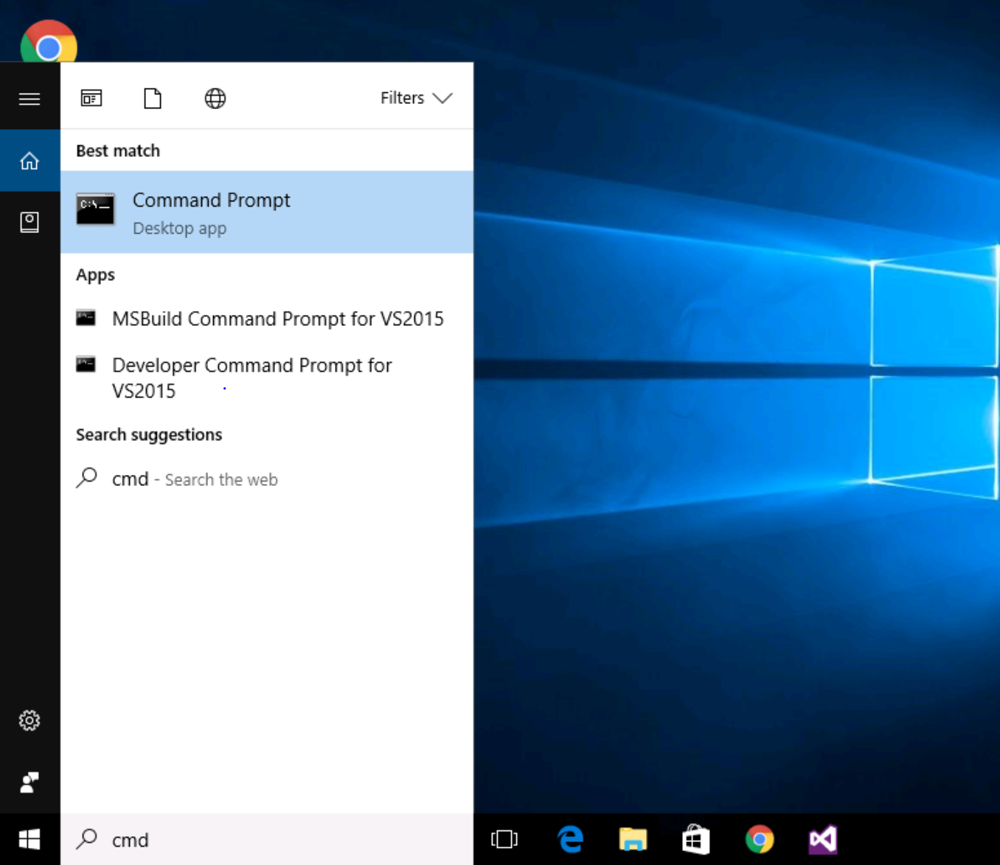
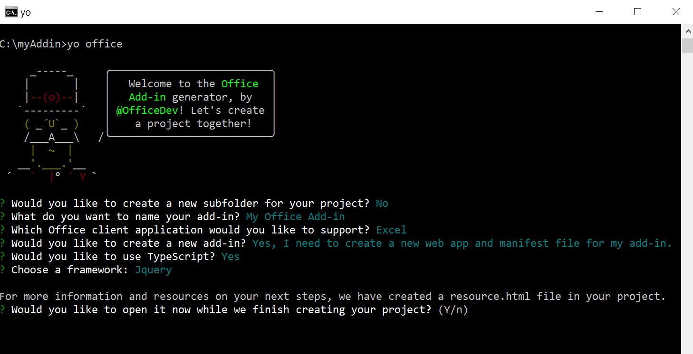
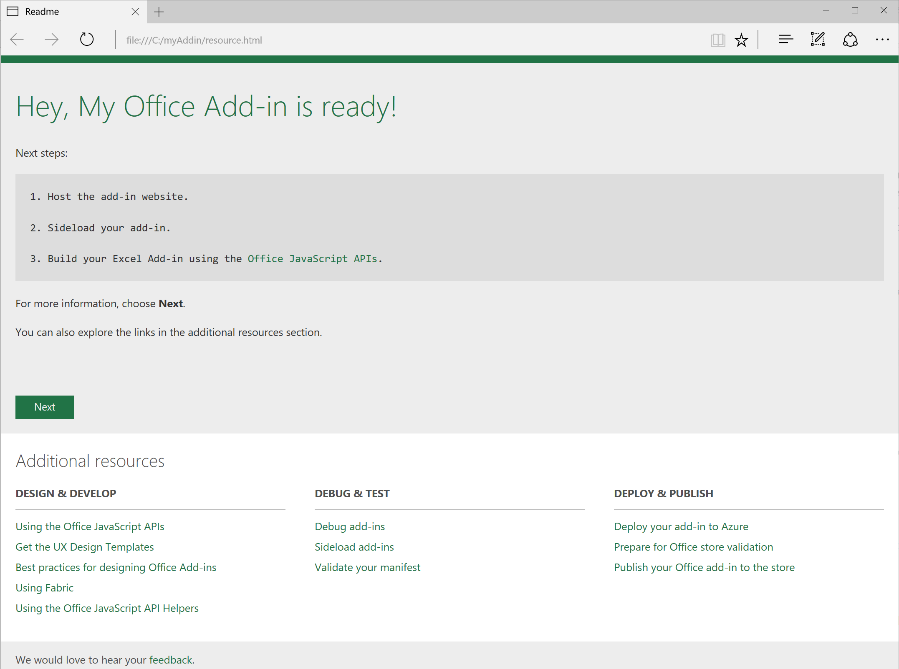
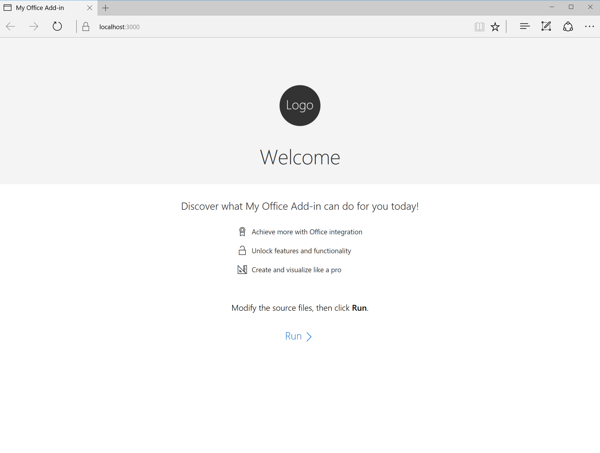
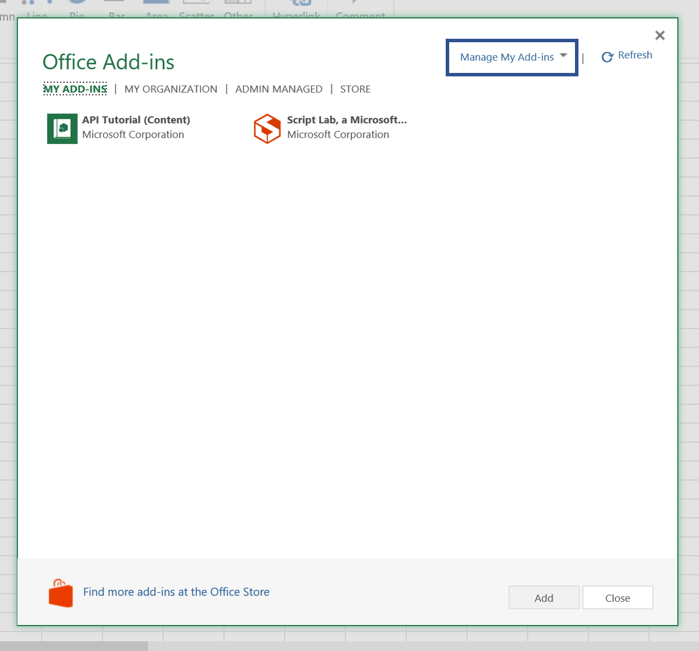
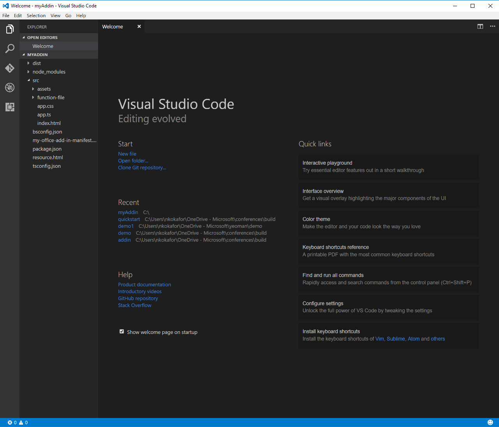
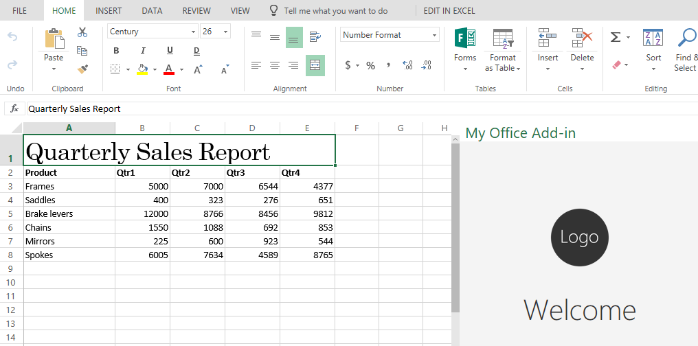
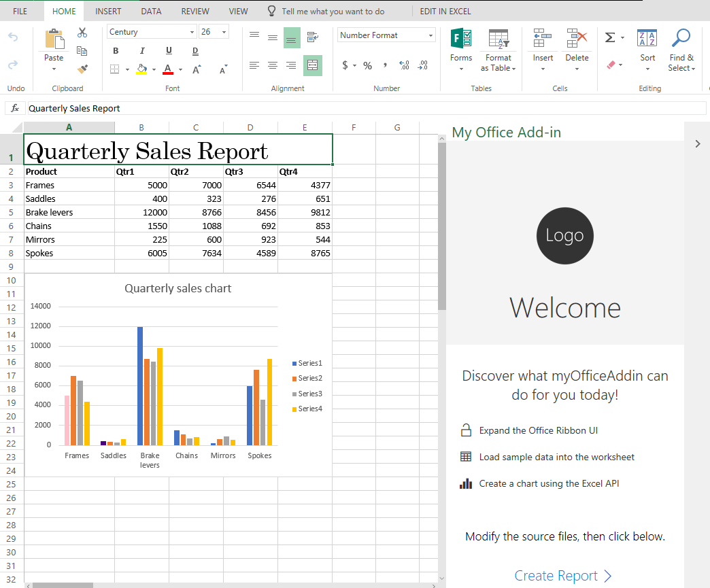

# Build Your First Office Integration

## Overview
With Office Add-ins, you can add new functionality to Office and embed your rich and interactive content. In this walk through, you will get hands-on experience developing an Excel add-in with Yo Office. Your final add-in will be able to write data to a workbook and apply basic formatting, as well as bound a chart to that data. If you would instead like to create an add-in using Visual Studio, see Building Your First Office Integration with Visual Studio.

## Tools You’ll Use
Command Prompt

Yo Office

Visual Studio Code

## Part 1: Getting Started

1.	Search for and open the command prompt. 

	 

2.	Run the following command to install Yo Office and its dependencies: 
	```
	npm install -g yo generator-office
	```
 
3.	Use the following commands to change the directory to the C:\ folder. Then, create a folder called “myAddin”:
	```
	# Change directory
	cd \

	# Create new folder
	mkdir myAddin
	```
 
4.	Change the directory to the myAddin folder. Then, run the Office Yeoman generator to create the project scaffolding, using the following commands: 

	 ```
	 # Change directory
	 cd myAddin

	 # Run Yo Office
	 yo office
	 ```
	 Yo Office will launch and prompt you with the following questions: 
  
	  |Question|Answer|
	  |-|-|
	  |Would you like to create a new subfolder for your project?|No <br> (Press Enter to accept the default)|
	  |What do you want to name your add-in?|My Office Add-in <br> (Press Enter to accept the default)|
	  |Which Office client application would you like to support?|Excel <br> (Press Enter to accept the default)|
	  |Would you like to create a new add-in?|Yes, I want a new web app and manifest <br> (Press Enter to accept the default)|
	  |Would you like to use TypeScript?|Yes <br> (Press Enter to accept the default)|
	  |Choose a framework:|Jquery <br> (Press Enter to accept the default)|
  
  	 
	 
	  > If installing and running a Yeoman generator for the first time on your machine, you may be prompted to anonymously report usage statistics before Yo Office is launched. This allows the Yeoman team to continue to improve the platform and deliver the best services. We recommend allowing your data to be collected, but if you don’t feel comfortable sharing your data, feel free to decline.
   
5. Once you have entered the above information, Yo Office will prompt you to open a resource page for more information and guidance.  **Choose Yes (press Enter to accept the default)**, and explore the plethora of resources available to Office add-in developers. In the background, Yo Office will continue to create your templates and install any remaining dependencies necessary for building the rest of your add-in. 

	

6.	Once Yo Office has finished running, host the add-in through npm using the following command:
	```
	npm start
	```
	> When developing an add-in on your machine, you can host your add-in locally, or use any web server or hosting technology – just make sure that the add-in is served using HTTPS, and update the add-in’s source location in the manifest. 
  
 7. Once successfully started, the following page will open in your default browser. This is the default template for the add-in. Confirm that you do not have an error, then **close this page**.
 
	

	> Typically, the first time an Office Add-in is hosted on a machine through npm, the browser will throw an error, and you will need to [add the self-signed security certificate](https://github.com/OfficeDev/generator-office/blob/master/src/docs/ssl.md) that is created as a trusted root certificate or your add-in will not display. This walkthrough bypasses that step.

8.	Load the add-in into Office. The easiest way to do this is by sideloading the add-in in Office Online:
  
    a.	Go to Excel Online (https://office.live.com/start/excel.aspx). Choose **Sign in with a work or school account** and sign in with the credentials at your station.
    > If working on your personal machine, you can log in with your work, school, or Microsoft account, as preferred.
  
    b.	Create a blank workbook. Then go to **Insert > Office Add-ins**.
  
    c.	On the **My Add-ins** tab, click the link in the upper-right corner of the dialog box to **Manage My Add-ins**. This will open a menu where you can then choose **Upload My Add-in**.
    
    
  
    d.	In the Upload Add-in dialog, choose **Browse** and select the *my-office-add-in-manifest.xml* file in the C:\myAddin\  directory. Then, choose **Upload**. 

9. Your add-in will be loaded in Excel and a button will appear on the Home Tab ribbon. Click this button to reveal your add-in.
    > **Important**: Leave this Excel document open with the add-in loaded for the rest of the walkthrough.

	
	
	

## Part 2: Customize the Office Ribbon UI

1. Open a new command prompt, and change the current directory to the C:\myAddin folder. Run the following command to open your project folder in Visual Studio Code.

	```
	code .
	```
	
	
	
2. Take a look at the structure of your new add-in project in the Solution Explorer. The source files that define the web portion of the add-in are contained in the **src** folder. You should also observe that the root folder of the project contains a top-level manifest, *my-office-addin-manifest.xml*. Double click this file to open it in the editor. Browse through the file and note the different options you can set for your Add-in, such as provider, version, Display Name.

3. Now, find the XML block that looks like this (line 75). Take a minute and read through it as it describes how add-ins can integrate with the Office UI. The example below demonstrates how an add-in can add a button to the Word ribbon's Home tab using Add-in commands. 

	```XML
        <!-- PrimaryCommandSurface==Main Office Ribbon. -->
            <ExtensionPoint xsi:type="PrimaryCommandSurface">
                <!-- Use OfficeTab to extend an existing Tab. Use CustomTab to create a new tab. -->
                <OfficeTab id="TabHome">
                <!-- Ensure you provide a unique id for the group. Recommendation for any IDs is to namespace using your company name. -->
                <Group id="Contoso.Group1">
                    <!-- Label for your group. resid must point to a ShortString resource. -->
                    <Label resid="Contoso.Group1Label" />
                    <!-- Icons. Required sizes 16,32,80, optional 20, 24, 40, 48, 64. Strongly recommended to provide all sizes for great UX. -->
                    <!-- Use PNG icons and remember that all URLs on the resources section must use HTTPS. -->
                    <Icon>
                    <bt:Image size="16" resid="Contoso.tpicon_16x16" />
                    <bt:Image size="32" resid="Contoso.tpicon_32x32" />
                    <bt:Image size="80" resid="Contoso.tpicon_80x80" />
                    </Icon>

                    <!-- Control. It can be of type "Button" or "Menu". -->
                    <Control xsi:type="Button" id="Contoso.TaskpaneButton">
                    <Label resid="Contoso.TaskpaneButton.Label" />
                    <Supertip>
                        <!-- ToolTip title. resid must point to a ShortString resource. -->
                        <Title resid="Contoso.TaskpaneButton.Label" />
                        <!-- ToolTip description. resid must point to a LongString resource. -->
                        <Description resid="Contoso.TaskpaneButton.Tooltip" />
                    </Supertip>
                    <Icon>
                        <bt:Image size="16" resid="Contoso.tpicon_16x16" />
                        <bt:Image size="32" resid="Contoso.tpicon_32x32" />
                        <bt:Image size="80" resid="Contoso.tpicon_80x80" />
                    </Icon>

                    <!-- This is what happens when the command is triggered (E.g. click on the Ribbon). Supported actions are ExecuteFuncion or ShowTaskpane. -->
                    <Action xsi:type="ShowTaskpane">
                        <TaskpaneId>ButtonId1</TaskpaneId>
                        <!-- Provide a url resource id for the location that will be displayed on the task pane. -->
                         <SourceLocation resid="Contoso.Taskpane.Url" />
                    </Action>
                    </Control>
                </Group>
                </OfficeTab>
            </ExtensionPoint>
	```

4. Let's modify the button to say "Hello World" instead of "Show Taskpane". Find the following element in the file (line 92).

	```XML
		<Title resid="Contoso.TaskpaneButton.Label" />
	```
	This indicates that the label of the title is stored in a string resource named **Contoso.TaskpaneButton.Label**.
5. Scroll down until you find the **ShortString** string resource with that label (line 133).
6. Now, set the DefaultValue attribute to *Hello World*. Your XML should look like this: 

	```XML
		<bt:String id="Contoso.TaskpaneButton.Label" DefaultValue="Hello World" />
	```

7. Go to **File > Save All** to save the changes. 
8. Switch back to the browser with Excel and sideload the add-in again (repeat steps 8b-8d). The label of the button should now say "Hello World".
	> Office only parses the manifest file when the add-in is loaded. Therefore, when you make updates to the manifest, you have to reload the add-in to see the changes reflected.

	

## Part 3: Write data to workbook
Now, let's move on to add functionality to the add-in. Go back to the project in Visual Studio Code. There are two very important files that are in the **src** folder of the project. One of them is the index.html page, which represents the add-in's starting page. Double click **index.html** in the Solution Explorer to open it in a code editor window. You will see some HTML that begins like this:

```html
<head>
    <meta charset="UTF-8" />
    <meta http-equiv="X-UA-Compatible" content="IE=Edge" />
    <meta name="viewport" content="width=device-width, initial-scale=1">
    <title>My office add-in</title>

    <!-- Office JavaScript API -->
    <script type="text/javascript" src="https://appsforoffice.microsoft.com/lib/1.1/hosted/office.debug.js"></script>

    <!-- LOCAL -->
    <link rel="stylesheet" href="node_modules/office-ui-fabric-js/dist/css/fabric.min.css" />
    <link rel="stylesheet" href="node_modules/office-ui-fabric-js/dist/css/fabric.components.css" />

    <!-- CDN -->
    <!-- For the Office UI Fabric, go to http://aka.ms/office-ui-fabric to learn more. -->
    <!--<link rel="stylesheet" href="https://static2.sharepointonline.com/files/fabric/office-ui-fabric-js/1.2.0/css/fabric.min.css" />-->
    <!--<link rel="stylesheet" href="https://static2.sharepointonline.com/files/fabric/office-ui-fabric-js/1.2.0/css/fabric.components.min.css" />-->

    <!-- Template styles -->
    <link href="app.css" rel="stylesheet" type="text/css" />
</head>
```

There are important references included in the **index.html** head element. One for our Office.js library **<script type="text/javascript" src="https://appsforoffice.microsoft.com/lib/1.1/hosted/office.debug.js"></script>**, which enables the developer to interact with Excel. There is also a reference to include  Office UI Fabric components, which are the UI building blocks, optimized for Office, to make your add-in look great. If you scroll to the bottom of the html page, you will also see a reference to the **app.js** script at the end of the body element, which implements the logic of the add-in.
 
First, let's add logic to the **app.ts** file to write data to the workbook.

1. Double-click **app.ts** (in the *src* folder) to open the file in a code editor window.
2. Replace the **run** function with the following snippet.
	 ```javascript
	/** Load sample data into a new worksheet and create a chart */
	async function createReport() {
	    try {
		await Excel.run(async (context) => {
		    // Create a proxy object for a new worksheet
		    const sheet = context.workbook.worksheets.add();

		    try {
			await writeSheetData(sheet);
			sheet.activate();
			await context.sync();
		    }
		    catch (error) {
			/**
			 * Try to activate the new sheet regardless, to show
			 * how far the processing got before failing
			 */
			sheet.activate();
			await context.sync();

			/**
			 * Then re-throw the original error, for appropriate error-handling
			 * (in this snippet, simply showing a notification)
			 */
			throw error;
		    }
		});

		showNotification("Report generated successfully.");
	    }
	    catch (error) {
		console.log(error);
		showNotification("Failed to generate report. See console for errors.")
	    }

	    async function writeSheetData(sheet: Excel.Worksheet) {
		// Set the report title in the worksheet
		const titleCell = sheet.getCell(0, 0);
		titleCell.values = [["Quarterly Sales Report"]];
		titleCell.format.font.name = "Century";
		titleCell.format.font.size = 26;

		// Create an array containing sample data
		const headerNames = ["Product", "Qtr1", "Qtr2", "Qtr3", "Qtr4"];
		const data = [
		    ["Frames", 5000, 7000, 6544, 4377],
		    ["Saddles", 400, 323, 276, 651],
		    ["Brake levers", 12000, 8766, 8456, 9812],
		    ["Chains", 1550, 1088, 692, 853],
		    ["Mirrors", 225, 600, 923, 544],
		    ["Spokes", 6005, 7634, 4589, 8765]
		];

		// Write the sample data to the specified range in the worksheet 
		// and bold the header row
		const headerRow = titleCell.getOffsetRange(1, 0)
		    .getResizedRange(0, headerNames.length - 1);
		headerRow.values = [headerNames];
		headerRow.getRow(0).format.font.bold = true;

		const dataRange = headerRow.getOffsetRange(1, 0)
		    .getResizedRange(data.length - 1, 0);
		dataRange.values = data;


		titleCell.getResizedRange(0, headerNames.length - 1).merge();
		dataRange.format.autofitColumns();

		const columnRanges = headerNames.map((header, index) => dataRange.getColumn(index).load("format/columnWidth"));
		await sheet.context.sync();

		// For the header (product name) column, make it a minimum of 100px;
		const firstColumn = columnRanges.shift();
		if (firstColumn.format.columnWidth < 100) {
		    console.log("Expanding the first column to 100px");
		    firstColumn.format.columnWidth = 100;
		}

		// For the remainder, make them identical or a minimum of 60px
		let minColumnWidth = 60;
		columnRanges.forEach((column, index) => {
		    console.log(`Column #${index + 1}: auto-fitted width = ${column.format.columnWidth}`);
		    minColumnWidth = Math.max(minColumnWidth, column.format.columnWidth);
		})
		console.log(`Setting data columns to a width of ${minColumnWidth} pixels`);
		dataRange.getOffsetRange(0, 1).getResizedRange(0, -1)
		    .format.columnWidth = minColumnWidth;
	    }
	}
	
	/**
	 * Display the notification having synced the changes.
	 */
	function showNotification(message: string) {
	    const messageBanner = $('.ms-MessageBanner');
	    $('.ms-MessageBanner-clipper').text(message);
	    $('.ms-MessageBanner-close').click(() => {
		messageBanner.hide();
		messageBanner.off('click');
	    });
	    messageBanner.show();
	}
	 ```

	This will create an array of sample data, and write the sample data (with basic formatting) to the specified range in the worksheet. It will also display notifications within the add-in. 

3. Update the click handler in the **Office.initialize** function (line 10) to the following.
	```javascript
	$("#run").click(createReport);
	```

	Your final app.ts file should look like this:
	```javascript
	(() => {
	  // The initialize function must be run each time a new page is loaded
	  Office.initialize = (reason) => {
	    $(document).ready(() => {
	      $("#run").click(createReport);
	    });
	  };

	/** Load sample data into a new worksheet and create a chart */
	async function createReport() {
	    try {
		await Excel.run(async (context) => {
		    // Create a proxy object for a new worksheet
		    const sheet = context.workbook.worksheets.add();

		    try {
			await writeSheetData(sheet);
			sheet.activate();
			await context.sync();
		    }
		    catch (error) {
			/**
			 * Try to activate the new sheet regardless, to show
			 * how far the processing got before failing
			 */
			sheet.activate();
			await context.sync();

			/**
			 * Then re-throw the original error, for appropriate error-handling
			 * (in this snippet, simply showing a notification)
			 */
			throw error;
		    }
		});

		showNotification("Report generated successfully.");
	    }
	    catch (error) {
		console.log(error);
		showNotification("Failed to generate report. See console for errors.")
	    }

	    async function writeSheetData(sheet: Excel.Worksheet) {
		// Set the report title in the worksheet
		const titleCell = sheet.getCell(0, 0);
		titleCell.values = [["Quarterly Sales Report"]];
		titleCell.format.font.name = "Century";
		titleCell.format.font.size = 26;

		// Create an array containing sample data
		const headerNames = ["Product", "Qtr1", "Qtr2", "Qtr3", "Qtr4"];
		const data = [
		    ["Frames", 5000, 7000, 6544, 4377],
		    ["Saddles", 400, 323, 276, 651],
		    ["Brake levers", 12000, 8766, 8456, 9812],
		    ["Chains", 1550, 1088, 692, 853],
		    ["Mirrors", 225, 600, 923, 544],
		    ["Spokes", 6005, 7634, 4589, 8765]
		];

		// Write the sample data to the specified range in the worksheet 
		// and bold the header row
		const headerRow = titleCell.getOffsetRange(1, 0)
		    .getResizedRange(0, headerNames.length - 1);
		headerRow.values = [headerNames];
		headerRow.getRow(0).format.font.bold = true;

		const dataRange = headerRow.getOffsetRange(1, 0)
		    .getResizedRange(data.length - 1, 0);
		dataRange.values = data;


		titleCell.getResizedRange(0, headerNames.length - 1).merge();
		dataRange.format.autofitColumns();

		const columnRanges = headerNames.map((header, index) => dataRange.getColumn(index).load("format/columnWidth"));
		await sheet.context.sync();

		// For the header (product name) column, make it a minimum of 100px;
		const firstColumn = columnRanges.shift();
		if (firstColumn.format.columnWidth < 100) {
		    console.log("Expanding the first column to 100px");
		    firstColumn.format.columnWidth = 100;
		}

		// For the remainder, make them identical or a minimum of 60px
		let minColumnWidth = 60;
		columnRanges.forEach((column, index) => {
		    console.log(`Column #${index + 1}: auto-fitted width = ${column.format.columnWidth}`);
		    minColumnWidth = Math.max(minColumnWidth, column.format.columnWidth);
		})
		console.log(`Setting data columns to a width of ${minColumnWidth} pixels`);
		dataRange.getOffsetRange(0, 1).getResizedRange(0, -1)
		    .format.columnWidth = minColumnWidth;
	    }
	}

	/**
	 * Display the notification having synced the changes.
	 */
	function showNotification(message: string) {
	    const messageBanner = $('.ms-MessageBanner');
	    $('.ms-MessageBanner-clipper').text(message);
	    $('.ms-MessageBanner-close').click(() => {
		messageBanner.hide();
		messageBanner.off('click');
	    });
	    messageBanner.show();
	}

	})();

	```
4. Now it's time to examine the HTML that has been added to the project to create the add-in's user interface. Save the **app.ts** file. Then, reopen the **index.html**  file. 

5. Replace the **main** element (line 34) within **index.html** with the following HTML layout, which will modify the add-in's layout for the new logic.

	```html
	    <main class="ms-welcome__main">
		<h2 class="ms-font-xl ms-fontWeight-semilight ms-fontColor-neutralPrimary ms-u-slideUpIn20"> Discover what myOfficeAddin can do for you today! </h2>
		<ul class="ms-List ms-welcome__features ms-u-slideUpIn10">
		    <li class="ms-ListItem">
			<i class="ms-Icon ms-Icon--Unlock"></i>
			<span class="ms-font-m ms-fontColor-neutralPrimary">Expand the Office Ribbon UI</span>
		    </li>
		    <li class="ms-ListItem">
			<i class="ms-Icon ms-Icon--Table"></i>
			<span class="ms-font-m ms-fontColor-neutralPrimary">Load sample data into the worksheet</span>
		    </li>
		    <li class="ms-ListItem">
			<i class="ms-Icon ms-Icon--BarChart4"></i>
			<span class="ms-font-m ms-fontColor-neutralPrimary">Create a chart using the Excel API</span>
		    </li>
		</ul>
		<br />
		<br />
		<p class="ms-font-l">Modify the source files, then click below.</p>
		<button id="run" class="ms-welcome__action ms-Button ms-Button--hero ms-u-slideUpIn20">
		    <span class="ms-Button-label">Create Report</span>
		    <span class="ms-Button-icon"><i class="ms-Icon ms-Icon--ChevronRight"></i></span>
		</button>
	    </main>
	```

6. Let's check out our progress! Save the index.html file. Then, go to the Excel page that contains your add-in. Click your **Hello World** button in the ribbon to refresh the add-in.

7. Click **Create Report**. A sample sales report split by quarters, for several products should load into your Excel file like this: 

	

## Part 4: Add a chart bound to that data
A common scenario in Excel is binding charts to data. *(Why?)* Let’s add a chart that is bound to our data. 

1. Go to Visual Studio Code and reopen the **app.ts** file in the src folder, and add the following code to the end of the **WriteSheetData** function:
	```javascript
		// Add a new chart
		const chart = sheet.charts.add(
		    Excel.ChartType.columnClustered,
		    dataRange, Excel.ChartSeriesBy.columns);

		// Set the properties and format the chart
		const chartTopRow = dataRange.getLastRow().getOffsetRange(2, 0);
		chart.setPosition(chartTopRow, chartTopRow.getOffsetRange(14, 0));
		chart.title.text = "Quarterly sales chart";
		chart.legend.position = "right"
		chart.legend.format.fill.setSolidColor("white");
		chart.dataLabels.format.font.size = 15;
		chart.dataLabels.format.font.color = "black";

		const points = chart.series.getItemAt(0).points;
		points.getItemAt(0).format.fill.setSolidColor("pink");
		points.getItemAt(1).format.fill.setSolidColor("indigo");
	```

	Your final **WriteSheetData** function should look like this:
	```javascript
	    async function writeSheetData(sheet: Excel.Worksheet) {
		// Set the report title in the worksheet
		const titleCell = sheet.getCell(0, 0);
		titleCell.values = [["Quarterly Sales Report"]];
		titleCell.format.font.name = "Century";
		titleCell.format.font.size = 26;

		// Create an array containing sample data
		const headerNames = ["Product", "Qtr1", "Qtr2", "Qtr3", "Qtr4"];
		const data = [
		    ["Frames", 5000, 7000, 6544, 4377],
		    ["Saddles", 400, 323, 276, 651],
		    ["Brake levers", 12000, 8766, 8456, 9812],
		    ["Chains", 1550, 1088, 692, 853],
		    ["Mirrors", 225, 600, 923, 544],
		    ["Spokes", 6005, 7634, 4589, 8765]
		];

		// Write the sample data to the specified range in the worksheet 
		// and bold the header row
		const headerRow = titleCell.getOffsetRange(1, 0)
		    .getResizedRange(0, headerNames.length - 1);
		headerRow.values = [headerNames];
		headerRow.getRow(0).format.font.bold = true;

		const dataRange = headerRow.getOffsetRange(1, 0)
		    .getResizedRange(data.length - 1, 0);
		dataRange.values = data;


		titleCell.getResizedRange(0, headerNames.length - 1).merge();
		dataRange.format.autofitColumns();

		const columnRanges = headerNames.map((header, index) => dataRange.getColumn(index).load("format/columnWidth"));
		await sheet.context.sync();

		// For the header (product name) column, make it a minimum of 100px;
		const firstColumn = columnRanges.shift();
		if (firstColumn.format.columnWidth < 100) {
		    console.log("Expanding the first column to 100px");
		    firstColumn.format.columnWidth = 100;
		}

		// For the remainder, make them identical or a minimum of 60px
		let minColumnWidth = 60;
		columnRanges.forEach((column, index) => {
		    console.log(`Column #${index + 1}: auto-fitted width = ${column.format.columnWidth}`);
		    minColumnWidth = Math.max(minColumnWidth, column.format.columnWidth);
		})
		console.log(`Setting data columns to a width of ${minColumnWidth} pixels`);
		dataRange.getOffsetRange(0, 1).getResizedRange(0, -1)
		    .format.columnWidth = minColumnWidth;


		// Add a new chart
		const chart = sheet.charts.add(
		    Excel.ChartType.columnClustered,
		    dataRange, Excel.ChartSeriesBy.columns);

		// Set the properties and format the chart
		const chartTopRow = dataRange.getLastRow().getOffsetRange(2, 0);
		chart.setPosition(chartTopRow, chartTopRow.getOffsetRange(14, 0));
		chart.title.text = "Quarterly sales chart";
		chart.legend.position = "right"
		chart.legend.format.fill.setSolidColor("white");
		chart.dataLabels.format.font.size = 15;
		chart.dataLabels.format.font.color = "black";

		const points = chart.series.getItemAt(0).points;
		points.getItemAt(0).format.fill.setSolidColor("pink");
		points.getItemAt(1).format.fill.setSolidColor("indigo");
	    }
	```

2. Save the app.ts file. Then, open Excel and press your **Hello World** button to refresh the add-in.
3. Click **Create Report** to run your add-in. You should see the same table from Part 3, but now with a chart below it. Since the chart is bound to the data, if you modify the table, the chart will also update. 

	

--

That’s it! Congratulation on creating your first Excel add-in that writes data to the workbook and creates a chart bound to that data.

